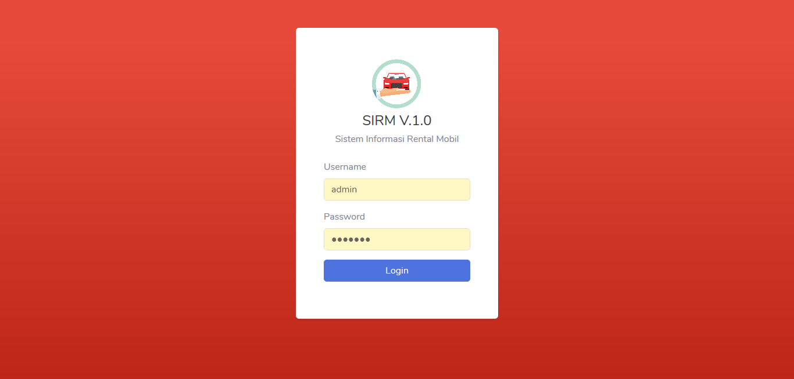

## Car Rental

Sistem Informasi Rental Mobil berbasis Laravel adalah aplikasi web modern yang dirancang untuk mengotomatisasi dan mempermudah seluruh alur bisnis penyewaan kendaraan.

## Fiitur

1. Management Pengguna
2. Management Mobil
3. Management Customer
4. Management Transaksi
5. Management List Transaksi Aktif
5. Management History Transaksi
6. Management Setting Aplikasi
7. Management Print Kuitansi Transaksi
8. Management Export Data Transaksi Via Excel
9. Integrasi dengan website (optional)

